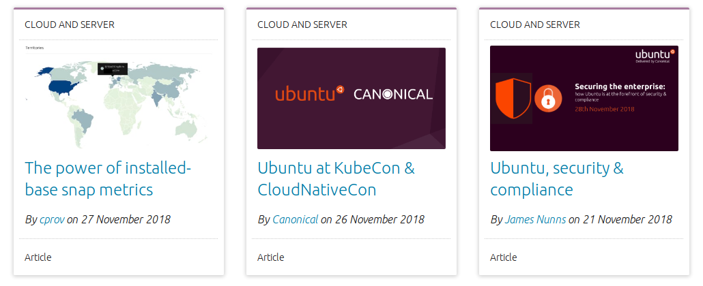

# canonical-vanilla-blog-posts

This project was made using [Vanilla](https://vanillaframework.io/) and [Next](https://nextjs.org).

It attempts to replicate the following image:



It pulls data from a sample API and populates the cards visible on screen.

## View project live

This project is live at [vanilla-project.lins.dev](https://vanilla-project.lins.dev), but you can run it
yourself using Node.js and NPM.

## Install and run

```
npm install
npm run dev
```
